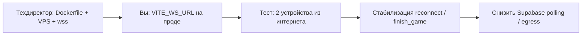

# Публикация «домашнего сервера» (LAN) и что дальше

Один документ на две темы:

1. **Когда и как выпустить установщик** для других пользователей (Rust, NSIS, сайт).
2. **Что делать вам сейчас** и **куда переходить** — облачный WS на VPS техдиректора.

Связанные файлы: [HOST-UTILITY.md](./HOST-UTILITY.md) (ежедневный LAN), [HOST-INSTALLER.md](./HOST-INSTALLER.md) (требования для пользователя `.exe`), [HOST-DESKTOP.md](./HOST-DESKTOP.md) (Tauri).

---

## 1. Вам сейчас Rust и установщик **не нужны**

**Верно:** на вашем ПК сервер уже есть. Для вечеринки по Wi‑Fi достаточно:

```powershell
cd D:\Projects\UpNDown
npm run host:app
```

Окно терминала **не закрывать**, пока идёт игра. Панель: `http://127.0.0.1:3001/host` → **Создать комнату** → QR / Поделиться.

Если меняли клиент (лобби, автовход гостей):

```powershell
npm run build:host-game
npm run host:kill
npm run host:app
```

| Нужно на вашем ПК | Не нужно на вашем ПК |
|-------------------|----------------------|
| Node.js 18+ (уже есть) | Rust, cargo |
| Wi‑Fi, брандмауэр | Сборка `host:desktop:build` |
| `npm run host:app` | Установщик NSIS |

**Установщик (.exe)** — для **чужих** ПК: скачали с сайта, поставили, играют без Node и без терминала. Это отдельный релиз, когда появится страница загрузки.

**Облачный онлайн** (игра из другого города) — **не** эта утилита. Там VPS техдиректора и `wss://` (см. § 4).

---

## 2. Когда понадобится публикация установщика

Запускайте сборку `.exe`, когда:

- есть **страница на сайте** «Скачать — игра в сети (Windows)»;
- готовы **обновлять** установщик при смене панели/QR/лобби (новый `host:installer:prep` + `host:desktop:build`);
- приняли, что размер установщика ~**50–80 МБ** (внутри portable Node + игра + сервер).

До этого вы и близкие круги спокойно играете через `host:app`.

---

## 3. Сборка установщика (только на машине **релиза**)

На компьютере, где **собираете** `.exe` (не обязательно на вашем игровом ПК).

### 3.1. Что установить один раз

| Компонент | Зачем | Ссылка |
|-----------|--------|--------|
| **Node.js 18+** | `npm install`, prep, сборка игры | https://nodejs.org |
| **Rust** (rustup) | Tauri / окно Windows | https://rustup.rs |
| **Visual Studio Build Tools** | C++ linker на Windows | https://visualstudio.microsoft.com/visual-cpp-build-tools/ |

В Build Tools включить workload **«Разработка классических приложений на C++»** (Desktop development with C++).

Проверка:

```powershell
node -v
npm -v
cargo --version
rustc --version
```

### 3.2. Команды сборки

```powershell
cd D:\Projects\UpNDown
git pull
npm install
npm run host:installer:prep
npm run host:desktop:build
```

**`host:installer:prep`** делает:

- `build:host-game` → `dist-host/` (страница для QR `/play/`);
- бандл сервера → `host-desktop/bundle/server.cjs` (LAN, без туннелей);
- скачивает `node.exe` в bundle (для упаковки; пользователю Node не ставить);
- копирует `dist-host` и `server/public` в `host-desktop/bundle/`.

**`host:desktop:build`** — NSIS-установщик:

`host-desktop\src-tauri\target\release\bundle\nsis\`

Файл вида `Up&Down — игра в сети_1.0.0_x64-setup.exe`.

### 3.3. Проверка bundle без Tauri

Если Rust ещё не ставили, можно проверить только сервер:

```powershell
npm run host:installer:prep
cd host-desktop\bundle
$env:GAME_DIST="$PWD\dist-host"
$env:UPDOWN_HOST_PUBLIC="$PWD\public"
.\node\node.exe .\server.cjs
```

Браузер: `http://localhost:3001/host`, в консоли — `host-panel-2026-06-06-installer` (или новее).

### 3.4. Типичные проблемы

| Симптом | Решение |
|---------|---------|
| `cargo` не найден | Установить rustup, перезапустить терминал |
| Ошибка линковки MSVC | Доставить VS Build Tools (C++) |
| Старая панель в `.exe` | Заново `host:installer:prep`, поднять версию в `server/src/hostPanelHtml.ts` |
| Порт 3001 занят при тесте | `npm run host:kill` |

---

## 4. Публикация на сайте (инструкция для пользователей)

### 4.1. Что выложить

- **Один файл:** `*-setup.exe` из `bundle\nsis\`.
- **Короткая страница** (можно скопировать из [HOST-INSTALLER.md](./HOST-INSTALLER.md)):
  - Windows 10/11;
  - одна Wi‑Fi с телефонами;
  - при первом запуске — разрешить брандмауэр;
  - открыть программу → Создать комнату → QR / Поделиться;
  - на телефоне — браузер, та же Wi‑Fi.

### 4.2. Чего не обещать на странице

- Игра **через интернет** с другого города (это VPS + `wss://`, не LAN-утилита).
- Работа **без Wi‑Fi** или через мобильный интернет гостя вне сети хоста.
- Обязательный аккаунт Up&Down (в LAN — нет).

### 4.3. Обновления

При изменении панели, QR, лобби гостей:

1. Поднять `SERVER_HTTP_BUILD` в `server/src/hostPanelHtml.ts`.
2. `npm run host:installer:prep`
3. Поднять `version` в `host-desktop/src-tauri/tauri.conf.json`.
4. `npm run host:desktop:build`
5. Заменить `.exe` на сайте, в release notes — «обновите, если гости видят старый экран».

### 4.4. Чеклист перед публикацией

- [ ] Сборка на чистой Windows (или CI) проходит без ошибок.
- [ ] После установки: создать комнату, QR открывается на телефоне в той же Wi‑Fi.
- [ ] Гость: экран «Вход в комнату», код/autojoin.
- [ ] Галочка «Показывать стол в Зале столов» — стол виден в зале.
- [ ] Закрытие окна программы освобождает порт (повторный запуск без `host:kill`).
- [ ] На странице сайта — ссылка на этот `.exe` и блок «что нужно на ПК».

---

## 5. Что дальше: WS на сервере техдиректора (облако)

LAN-утилита **закрыта** как продуктовая линия «домашний вечер». Следующий приоритет — **публичный онлайн** без VPN и без Supabase в процессе партии.

### 5.1. Что уже есть в репозитории (не начинать с нуля)

| Компонент | Статус |
|-----------|--------|
| Папка `server/` | WebSocket, комнаты, ходы, `host_dedicated`, панель `/host` |
| Клиент `VITE_ONLINE_TRANSPORT=ws` | Лобби, игра через `onlineGameWs.ts` |
| LAN на ПК | `npm run host:app` + `dist-host` на `:3001/play/` |
| Док по деплою | [ONLINE-SERVER-INSTRUCTIONS.md](./ONLINE-SERVER-INSTRUCTIONS.md) |

Устаревшая строка в [APP-WORKPLAN-WS-IAP-CC.md](./APP-WORKPLAN-WS-IAP-CC.md) («WS не реализован») — **не актуальна** для LAN/локального WS; для **прода на VPS** чеклист A1.6–A1.8 там по-прежнему в силе.

### 5.2. Роли: кто что делает

**Техдиректор (VPS, инфраструктура)**

1. **Dockerfile** для `server/` (пока нет в репо) + healthcheck `GET /api/version`.
2. **Деплой** на VPS (Linux): `docker run` или systemd + Node 18.
3. **Reverse proxy** (Caddy/nginx) → **`wss://game.ваш-домен`** на порт 3001.
4. **Файрвол:** снаружи 443, внутри — только localhost:3001.
5. **Автоперезапуск** (systemd, Docker restart, pm2).
6. Передать вам **финальный URL:** `wss://...` (без `/host` в пути — корень сокета).

Полная инструкция для техдиректора: [TECH-DIRECTOR-ONLINE-SERVER.md](./TECH-DIRECTOR-ONLINE-SERVER.md).  
Ваши шаги после его URL: [OWNER-AFTER-WS-READY.md](./OWNER-AFTER-WS-READY.md).

**Вы (владелец продукта, фронт и тест)**

1. В **продакшене** фронта (Vercel / хостинг игры):
   ```env
   VITE_ONLINE_TRANSPORT=ws
   VITE_WS_URL=wss://game.ваш-домен
   ```
   (URL даст техдиректор после деплоя.)
2. **Не смешивать** с LAN: для облака **не** нужны `host:app` и QR с IP ПК.
3. Прогнать сценарий: два телефона **разные сети** / мобильный интернет → лобби → код → партия.
4. Зафиксировать баги (reconnect, имена, банк, зал столов в облаке).

**В коде (по мере облачного запуска)**

- Рейтинг и `finish_game` в конце партии — сейчас в основном **Supabase-путь**; для чистого WS-прода может понадобиться A2.5 из workplan (один вызов Supabase после партии).
- Absent host / пауза — в WS MVP ограничены (`server/README.md`); не блокер первого `wss://` теста.

### 5.3. Предлагаемый порядок работ



| Шаг | Кто | Результат |
|-----|-----|-----------|
| 1 | Техдиректор | `wss://...` отвечает, `curl https://.../api/version` → `hostPanel` может быть false на VPS (панель `/host` на VPS не обязательна) |
| 2 | Вы | Прод-фронт с `VITE_ONLINE_TRANSPORT=ws` |
| 3 | Оба | Партия 4 игрока из разных сетей |
| 4 | Вы + техдиректор | Мониторинг, рестарты, логи |
| 5 | Вы | Решение: облако по умолчанию, LAN-утилита — отдельная загрузка на сайте |

### 5.4. Что **не** делать параллельно

- Не тянуть **Rust/NSIS**, пока не решили выкладывать LAN на сайт.
- Не путать **два URL**: LAN = `http://IP-ПК:3001/play/`, облако = `wss://game.домен` + обычный хостинг PWA/APK.
- Не деплоить на VPS **панель хоста** как основной продукт — на VPS нужен **игровой WS** для всех пользователей приложения.

### 5.5. Ваш ближайший фокус

1. **Сейчас:** LAN для тестов — `host:app` (без Rust).
2. **Параллельно:** передать техдиректору [ONLINE-SERVER-INSTRUCTIONS.md](./ONLINE-SERVER-INSTRUCTIONS.md) + папку `server/` (или доступ к репо).
3. **После URL `wss://`:** прописать env на проде и пройти облачный сценарий.
4. **Позже:** когда будет сайт — один раз собрать `.exe` по § 3 и выложить по § 4.

---

## 6. Краткая шпаргалка

| Задача | Команда / документ |
|--------|---------------------|
| Игра сегодня по Wi‑Fi | `npm run host:app` |
| Собрать `.exe` (позже) | § 3 → [HOST-INSTALLER.md](./HOST-INSTALLER.md) |
| Текст для страницы скачивания | § 4 |
| Облачный WS | [ONLINE-SERVER-INSTRUCTIONS.md](./ONLINE-SERVER-INSTRUCTIONS.md), § 5 выше |
| Стратегия трёх основателей | [ROADMAP-THREE-FOUNDERS.md](./ROADMAP-THREE-FOUNDERS.md) |
