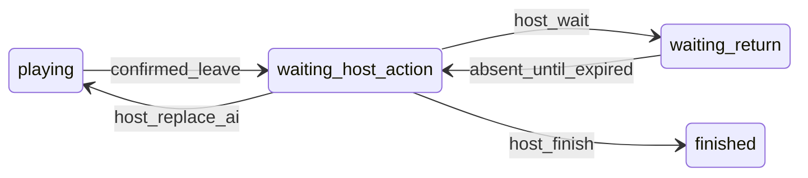

# Онлайн: выход из партии, `room_phase`, хост и закрытие вкладки

Цель: при подтверждённом выходе из **идущей** партии не подменять слот на ИИ автоматически; дать **текущему хосту** выбор (завершить / подождать / заменить на ИИ). Для **пропавшего хоста** (закрытая вкладка, нет `leaveRoom`) — фоновая смена хоста по `host_last_seen_at` + RPC только для `service_role`.

## Поля `game_rooms`

| Колонка | Назначение |
|--------|------------|
| `room_phase` | `lobby` \| `playing` \| `waiting_host_action` \| `waiting_return` \| `finished` |
| `absent_until` | До какого времени ждём возврат (ветка «подождать»). |
| `absent_slot_index` | Индекс слота 0..3 с отметкой `absent`. |
| `host_last_seen_at` | Последний `updown_host_ping` от пользователя = `host_user_id`. |

В `player_slots` у вышедшего выставляется `absent: true` (RPC `updown_mark_player_absent_confirmed_leave`), `userId` не трогаем до решения хоста.

## Диаграмма фаз (упрощённо)



## RPC (Postgres, `SECURITY DEFINER`)

| Имя | Кто вызывает | Назначение |
|-----|----------------|------------|
| `updown_host_ping(p_room_id)` | `authenticated`, текущий хост | Обновить `host_last_seen_at`. |
| `updown_transfer_host(p_room_id, p_new_host_user_id)` | Старый хост | Ручная передача хоста живому участнику в слотах. |
| `updown_mark_player_absent_confirmed_leave(p_room_id)` | Уходящий (`auth.uid()` в слоте) | Только при `room_phase = playing`: слот `absent`, `room_phase = waiting_host_action`, без ИИ. |
| `updown_leave_slot_while_host_resolves(p_room_id)` | Уходящий (`auth.uid()` в слоте) | При `waiting_host_action` \| `waiting_return`: слот сбрасывается в «родного» ИИ; если уходил хост — переназначение хоста (см. миграцию `20260428201500_...`). |
| `updown_host_resolve_absent(p_room_id, p_choice)` | Хост | `finish` \| `wait` \| `replace_ai` (ИИ только здесь). |
| `updown_auto_transfer_host_if_stale()` | **только `service_role`** | Хост не пинговал 90+ с, `room_phase = playing` → другой участник. |
| `updown_absent_wait_expired_tick()` | **только `service_role`** | Истёк `waiting_return` → снова `waiting_host_action`. |
| `updown_online_room_maintenance_tick()` | **только `service_role`** | Один вызов: stale host + expired wait; JSON со счётчиками. |

## История (ветка «завершить»)

Таблица `online_party_outcomes`: при `host_resolve_absent(..., 'finish')` пишется строка с `outcome_type = 'host_finish_early'` и снимком `game_state`.

## Клиент

- Типы: `GameRoomPhase`, поля в `GameRoomRow`, `PlayerSlot.absent`.
- Старт партии: `updateRoomState(..., { roomPhase: 'playing', hostLastSeenAtNow: true })`.
- Heartbeat: `heartbeatPresence` + для хоста в фазе `playing` — `updown_host_ping`.
- Выход из партии: `leaveRoom` при `status = playing` и `room_phase = playing` — `mark_absent`; при `waiting_host_action` / `waiting_return` — `updown_leave_slot_while_host_resolves` (иначе RPC absent отвечает `room_not_in_playing_phase` и клиент «не выходит»).
- ИИ на столе: не гонять авто-ИИ хоста, пока `room_phase !== 'playing'`.
- UI: хост перед выходом — предложение передать хоста; для нового хоста — модалка a/b/c; остальным — баннер.

## Фон (PR-E)

Рекомендуется **Edge Function** `online-room-maintenance` по расписанию (30–60 с), тело — RPC `updown_online_room_maintenance_tick` с **service role**. Код: `supabase/functions/online-room-maintenance/index.ts`.

Операционный runbook (Cron, Vault, JWT 401, миграции, чеклисты): **[`RUNBOOK-ONLINE-MAINTENANCE-TICK.md`](./RUNBOOK-ONLINE-MAINTENANCE-TICK.md)** — маркер **`RUNBOOK-ID: UPNDOWN-ONLINE-MAINT-2026-04-26`**.

Альтернатива: `pg_cron` в БД с тем же RPC от роли с правами.

## Порядок внедрения (PR)

1. Миграция колонок и RPC (`room_phase`, absent, host ping, maintenance).
2. Клиент: типы, `leaveRoom`, heartbeat `host_ping`, контекст.
3. ИИ: гейт по `room_phase === 'playing'`.
4. UI: передача хоста, модалка хоста, баннеры.
5. Cron / Edge для `updown_online_room_maintenance_tick`.
6. Документ (этот файл) + опционально доработка чтения `online_party_outcomes` в продукте.

## Константы

- Порог «мёртвого хоста» для авто-смены: **90 с** без обновления `host_last_seen_at` (см. миграцию).
- Ожидание возврата после «подождать»: **5 минут** (`updown_host_resolve_absent` ветка `wait`).

---

## Что уже сделано в репозитории (код + SQL-файл)

- В репозитории лежит **миграция** с колонками и RPC: `supabase/migrations/20260427120000_game_rooms_room_phase_absent_host.sql`.
- В репозитории лежит **черновик Edge Function**: `supabase/functions/online-room-maintenance/index.ts` (она только вызывает RPC с **service role**).

Пока ты **не применишь миграцию к своей БД в Supabase**, приложение может падать на новых RPC/колонках или вести себя по-старому — зависит от того, что уже есть в проекте.

---

## Что тебе сделать по шагам (один раз на проект Supabase)

### Шаг 1 — Применить миграцию к базе

**Вариант A — через Supabase CLI** (если проект уже связан с этим репо):

1. Установи [Supabase CLI](https://supabase.com/docs/guides/cli), залогинься: `supabase login`.
2. В корне репозитория: `supabase link` (если ещё не делала) — укажешь **project ref** из URL проекта (`https://supabase.com/dashboard/project/<ref>`).
3. Выполни: `supabase db push`  
   Это применит все новые файлы из `supabase/migrations/` к **удалённой** БД.

**Вариант B — без CLI, через веб-интерфейс:**

1. Открой Supabase → **SQL Editor**.
2. Открой локальный файл `supabase/migrations/20260427120000_game_rooms_room_phase_absent_host.sql`, скопируй **весь** текст.
3. Вставь в SQL Editor → **Run**.  
   Если что-то упадёт с ошибкой «уже существует» — пришли текст ошибки (часть могла уже применяться вручную).

После успеха в **Table Editor** у таблицы `game_rooms` должны появиться колонки `room_phase`, `absent_until`, и т.д.

---

### Шаг 2 — Фоновая задача: «мёртвый хост» и истечение ожидания

RPC `updown_online_room_maintenance_tick` может вызывать **только** роль с правами `service_role` (обычный пользователь из приложения её не дергает).

Нужно **один** из двух способов.

#### Способ 2a — Edge Function + расписание (рекомендуется Supabase)

1. Установи CLI и залогинься, привяжи проект: `supabase link` (как в шаге 1).
2. Задеплой функцию из корня репо:
   ```bash
   supabase functions deploy online-room-maintenance
   ```
3. В Dashboard: **Edge Functions** → выбери `online-room-maintenance` → раздел **Schedules / Cron** (название может чуть отличаться по версии UI) → создай расписание, например **каждые 60 секунд** (или 30).  
   URL/маршрут обычно подставляется сам; функция без параметров — просто HTTP-вызов.

После деплоя Supabase подставляет секреты `SUPABASE_URL` и `SUPABASE_SERVICE_ROLE_KEY` в среду функции — в коде они читаются из `Deno.env`.

**401 на вызовах из расписания:** шлюз Edge Functions по умолчанию требует заголовок `Authorization: Bearer <JWT>`. Планировщик Supabase часто шлёт запрос **без** Bearer → **401**, и код функции (в т.ч. RPC с service role) **не выполняется**. Что сделать (один из вариантов):

- В настройках функции отключить **Verify JWT** для этой конкретной функции (осознанный компромисс: защищайте URL секретом в теле/cron или дергайте только из доверенного cron), **или**
- Вызывать по расписанию URL с заголовком `Authorization: Bearer <anon key>` или сервисным ключом (храните ключ в секретах cron / внешнего планировщика, не в клиентском приложении).

Без успешных вызовов **не сработает** только фон: просроченный `waiting_return` и **автосмена хоста по `host_last_seen_at` при `room_phase = 'playing'`**. Это **не заменяет** переназначение хоста при «хост сам вышел через подтверждение» — для этого в БД есть отдельная правка в `updown_mark_player_absent_confirmed_leave` (миграция `20260428103000_...`).

**Проверка:** в **Edge Functions** → **Logs** через минуту-два должны быть успешные вызовы без 500. При желании в SQL Editor можно один раз вручную выполнить от имени сервиса не получится из UI как пользователь — проще смотреть логи Edge.

#### Способ 2b — Без Edge: `pg_cron` в Postgres

Если на тарифе/проекте доступен **pg_cron** (часто на Pro или по запросу):

1. Включи расширение и создай задачу, которая раз в минуту вызывает что-то вроде:
   ```sql
   select public.updown_online_room_maintenance_tick();
   ```
   Выполнять это нужно от роли, у которой есть `EXECUTE` на эту функцию для `service_role` (в миграции уже `grant execute ... to service_role`).  
   Точный синтаксис `pg_cron` зависит от того, как Supabase разрешил планировщик в твоём проекте — при необходимости см. [документацию Supabase по pg_cron](https://supabase.com/docs/guides/database/extensions/pg_cron).

Если **ни Edge, ни pg_cron не настроишь**, игра будет работать по новым правилам выхода/хоста, но **автосмена хоста при закрытой вкладке** и **автоперевод после истечения 5 минут ожидания** не сработают, пока фон не появится.

---

### Шаг 3 — Клиент (Vite)

Убедись, что фронт собран с тем же Supabase URL/anon key, что и проект, куда накатила миграцию (`.env` / `VITE_*` — как у вас принято в репо).

---

## Кратко: что «осталось» именно у тебя

| Действие | Зачем |
|----------|--------|
| Применить миграцию к БД | Чтобы колонки и RPC реально существовали в Supabase. |
| Задеплоить Edge `online-room-maintenance` **и** включить расписание **или** настроить `pg_cron` | Чтобы раз в минуту (или чаще) вызывался `updown_online_room_maintenance_tick` с service role. |

Всё остальное из плана (клиент, UI, типы) — уже в коде репозитория; без шагов 1–2 серверная часть фона просто не живёт в облаке.
